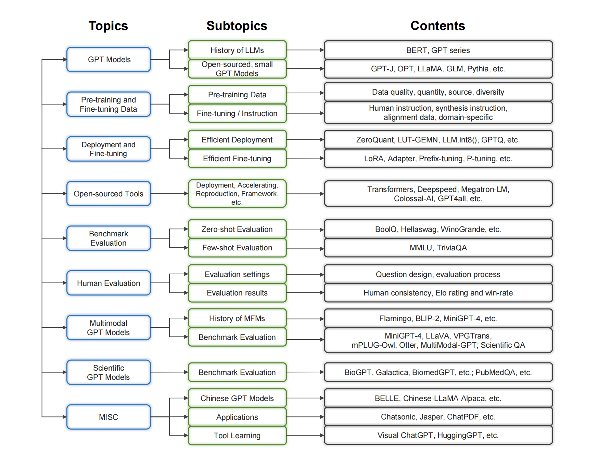
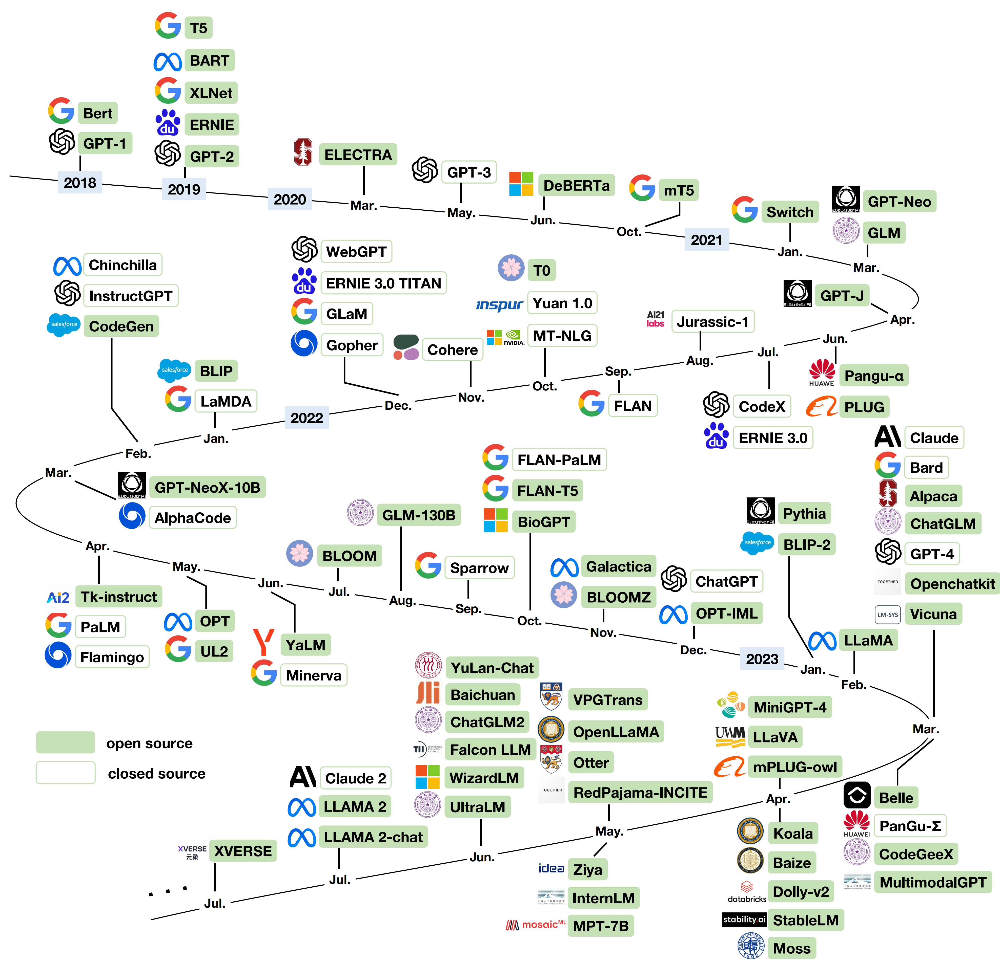

# gpt_alternatives

## 1 INTRODUCTION
The advent of generative pre-trained transformer (GPT) models has brought about a significant transformation in the field of natural language processing (NLP). These models, based on the transformer architecture, demonstrate exceptional capabilities in various NLP tasks. The continuous development of GPT models has led to increasingly larger and more sophisticated versions, with large GPT models like GPT-4 gaining significant attention for their unparalleled performance. However, despite their impressive capabilities, large GPT models have inherent limitations that restrict their widespread adoption, usability, and fine-tuning. The overview of the content is shown is Figure 1.

## 2 GPT AND GPT-LIKE MODELS

Table 1. Statistical overview of open large language models in recent years, categorized by base models
| **Model**                             | **#Param**                                                      | **Backbone**       | **Release Date** | **Training Data Source**                                                                                                              | **Training Data Size**    |
|---------------------------------------|-----------------------------------------------------------------|--------------------|------------------|---------------------------------------------------------------------------------------------------------------------------------------|---------------------------|
| T5  (enc-dec)                         | 60M, 220M, 770M, 3B, 11B                                        | Base Model         | 2019-10          | C4                                                                                                                                    | 1T tokens                 |
| mT5  (enc-dec)                        | 300M, 580M, 1.2B, 3.7B, 13B                                     | Base Model         | 2020-10          | mC4                                                                                                                                   | 1T tokens                 |
| GPT-Neo                               | 125M, 350M, 1.3B, 2.7B                                          | Base Model         | 2021-03          | the Pile                                                                                                                              | 825GB                     |
| GPT-NeoX                              | 20B                                                             | Base Model         | 2022-02          | the Pile                                                                                                                              | 825GB                     |
| GPT-J                                 | 6B                                                              | Base Model         | 2021-06          | the Pile                                                                                                                              | 825GB                     |
| OPT                                   | 125M, 1.3B, 2.7B, 6.7B, 13B, 30B, 66B, 175B                     | Base Model         | 2022-05          | the Pile                                                                                                                              | 180B tokens               |
| BLOOM                                 | 560M, 1.1B, 1B7, 3B, 7.1B, 176B                                 | Base Model         | 2022-07          | ROOTS corpus                                                                                                                          | 366B tokens               |
| BLOOMZ                                | 560M, 1.1B, 1B7, 3B, 7.1B, 176B                                 | BLOOM              | 2022-11          | xP3(extended from P3 )                                                                                                                | -                         |
| GLM                                   | 110M, 335M, 410M, 515M, 2B, 10B, 130B                           | Base Model         | 2021-03          | BooksCorpus  and                                                                                                                      |                           |
| English Wikipedia                     | -                                                               |                    |                  |                                                                                                                                       |                           |
| GLM-130B                              | 130B                                                            | Base Model         | 2022-08          | -                                                                                                                                     | -                         |
| ChatGLM                               | 6B                                                              | GLM                | 2023-03          | -                                                                                                                                     | -                         |
| ChatGLM2                              | 6B                                                              | GLM                | 2023-06          | -                                                                                                                                     | -                         |
| LLaMA                                 | 7B, 13B, 33B, 65B                                               | Base Model         | 2023-02          | English CommonCrawl, C4 , Github, Wikipedia, Gutenberg Books3 and Stack Exchange                                                      | 1.4T tokens               |
| OpenLLaMA                             | 3B, 7B                                                          | Replicate of LLaMA | 2023-05          |                                                                                                                                       |                           |
| Alpaca                                | 7B                                                              | LLaMA              | 2023-03          | data generated from text-davinci-003                                                                                                  | 52K                       |
| Vicuna                                | 7B, 13B                                                         | LLaMA              | 2023-03          | user-shared conversations from ShareGPT                                                                                               | 70K                       |
| StableVicuna                          | 13B                                                             | LLaMA \            | Vicuna           | 2023-04                                                                                                                               | -                         |
| BAIZE                                 | 7B, 13B, 30B                                                    | LLaMA              | 2023-04          | dialogs from Quora, StackOverFlow and MedQuAD questions                                                                               | 54K/57K/47K               |
| Koala                                 | 13B                                                             | LLaMA              | 2023-04          | A gather of ShareGPT\footnote{\url{https://sharegpt.com}}, HC3                                                                        | -                         |
| WizardLM                              | 7B, 13B, 30B                                                    | LLaMA              | 2023-06          | evolved instructions (from ShareGPT)/evolved instructions (from Alpaca  data)                                                         | 250k/70k                  |
| UltraLM                               | 13B                                                             | LLaMA              | 2023-06          | UltraChat                                                                                                                             | -                         |
| Pythia                                | 70M, 160M, 410M, 1B, 1.4B, 2.8B, 6.9B, 12B                      | Base Model         | 2023-01          | the Pile /the Pile with deduplication applied                                                                                         | 299.9B tokens/207B tokens |
| Dolly-v2                              | 12B                                                             | Pythia             | 2023-04          | instruction/response finetuning records                                                                                               | \textasciitilde 15k       |
| Openchatkit                           | 7B                                                              | Pythia             | 2023-03          | the OIG\footnote{\url{https://laion.ai/blog/oig-dataset/}} dataset                                                                    |                           |
| BELLE-7B                              | 7B                                                              | Pythia             | 2023-03          | a Chinese Dataset\footnote{\url{https://github.com/LianjiaTech/BELLE/tree/main/data/1.5M}}                                            | 1.5M                      |
| StableLM-Alpha                        | 3B, 7B                                                          | Base Model         | 2023-04          | dataset that build on the Pile                                                                                                        | 1.5T tokens               |
| StableLM-Tuned-Alpha                  | 7B                                                              | StableLM           | 2023-04          | Stanford's Alpaca, Nomic-AI's gpt4all, RyokoAI's ShareGPT-52K datasets \cite{sharegpt52K}, Databricks labs' Dolly, and Anthropic's HH | -                         |
| RWKV                                  | 169M, 430M, 1.5B, 3B, 7B, 14B                                   | Base Model         | -                | the Pile                                                                                                                              | 825GB                     |
| ChatRWKV                              | 7B, 14B                                                         | RWKV               | 2022-12          | -                                                                                                                                     | -                         |
| moss-moon-003-base                    | 16B                                                             | base model         | 2023-04          | -                                                                                                                                     | 700B tokens               |
| moss-moon-003-sft                     | 16B                                                             | moss-moon-003-base | 2023-04          | multi-round conversational data                                                                                                       | 1.1 million               |
| RedPajama-INCITE                      | 3B, 7B                                                          | Base Model         | 2023-05          | RedPajama-Data                                                                                                                        | 1.2T tokens               |
| MPT-7B                                | 7B                                                              | Base Model         | 2023-05          | -                                                                                                                                     | 1T tokens                 |
| MPT-7B-Chat                           | 7B                                                              | MPT-7B             | 2023-05          | ShareGPT-Vicuna, HC3, Alpaca, Helpful and Harmless, and Evol-Instruct datasets                                                        | -                         |
| Falcon LLM                            | 7B, 40B                                                         | Base Model         | 2023-06          | -                                                                                                                                     | 1T tokens                 |
| InternLM                              | 7B                                                              | Base Model         | 2023-06          | -                                                                                                                                     | trillions of tokens       |
| InternLM Chat                         | 7B                                                              | InternLM           | 2023-06          | -                                                                                                                                     | -                         |
| Baichuan                              | 7B                                                              | Base Model         | 2023-06          | -                                                                                                                                     | 1.2T tokens               |
| LLAMA 2                               | 7B, 13B, 70B                                                    | Base Model         | 2023-07          | a mix of data from publicly available sources                                                                                         | 2T tokens                 |
| LLAMA 2-CHAT                          | 7B, 13B, 70B                                                    | LLAMA 2            | 2023-07          | publicly available instruction tuning                                                                                                 |                           |
| data and vendor-based annotation data | 27,540 instruction tuning data, 2,919,326 human preference data |                    |                  |                                                                                                                                       |                           |
| Qwen                                  | 7B                                                              | Base Model         | 2023-08          | -                                                                                                                                     | 2.2T tokens               |
| Qwen-Chat                             | 7B                                                              | Qwen               | 2023-08          | -                                                                                                                                     | -                         |

## 3 PRE-TRAINING AND FINE-TUNING DA

### 3.1 Pre-training Data
#### Classifier-based Filtering ####
* **GPT-3** devised an automated filtering method to effectively eliminate low-quality documents from the Common Crawl dataset. It used a classifier trained on high-quality data (WebText, Wikipedia, and web books corpus) to prioritize documents with higher scores, resulting in improved data quality for generative text samples. Moreover, GPT-3 adopted fuzzy deduplication of documents within each dataset and the removal of WebText from Common Crawl, further improving the data quality.
* **PaLM** following **GLaM**, developed a text quality classifier to distinguish between high-quality content (curated text from Wikipedia, books, and selected websites) and other webpages. Using a feature hash-based linear classifier, they both estimated the content quality of webpages and applied a Pareto distribution to sample webpages based on their scores, including some lower-quality webpages to avoid biases in the classifier.

#### Rule-based Filtering ####
* **Gopher** uses simple heuristic filters to remove low-quality text based on word count, word lengths, symbol-to-word ratios, bullet points, and ellipses. They ensure data quality by filtering out documents lacking essential English words and removing exact and near-duplicate documents.
* **BLOOM** aimed to identify high-quality text written by humans for humans, excluding non-natural language content like preprocessing errors, SEO pages, or spam. It defined a set of quality indicators individually tailored for each language, with parameters and thresholds chosen by fluent speakers. Additionally, the authors manually reviewed each source to identify the indicators best suited to detect non-natural language, and visualization tools supported these processes.
* **Falcon LLM** is a language model pretrained on the RefinedWeb Dataset \cite{DBLP:journals/corr/abs-2306-01116}, an English web-only pretraining dataset containing five trillion tokens. The authors claimed that by using properly filtered and deduplicated web data, Falcon LLM achieves impressive performance, even surpassing state-of-the-art models trained on The Pile. The filtering process involves both document-wise and line-wise procedures, using heuristics to detect and eliminate excessive repetitions and non-natural language content.

### 3.2 Fine-tuning / Instruction Data

#### 3.2.1 Human Instruction Data
* **InstructGPT**. In InstructGPT, human-written data is used to train the initial models. Labelers were asked to create three types of prompts: plain prompts with arbitrary tasks to ensure diversity, few-shot prompts with instructions and multiple query/response pairs, and user-based prompts corresponding to specific use cases. These prompts were then used to create three datasets: SFT dataset for training SFT models, RM dataset for training reward models with labeler rankings, and PPO dataset for RLHF fine-tuning without human labels. The SFT dataset contains about 13k training prompts, the RM dataset has 33k training prompts, and the PPO dataset has 31k training prompts from the API.
* **ShareGPT Data**. ShareGPT is a user-friendly Chrome Extension that simplifies sharing ChatGPT conversations effortlessly (https://sharegpt.com). Some datasets can also be obtained from ShareGPT, offering a valuable resource for researchers and enthusiasts interested in utilizing ChatGPT's conversational data. 
* **ShareGPT-90K** (formerly 52k). This dataset comprises around 90k (52k in the old version) conversations obtained via the ShareGPT API. These conversations encompass user prompts and responses from OpenAI's ChatGPT.
* **ShareGPT-Vicuna-70k**. This dataset comprises approximately 70k user-shared conversations obtained from the ShareGPT API. To ensure high data quality, the dataset undergoes a process of converting HTML to markdown and filtering out inappropriate or low-quality samples. Additionally, to accommodate the model's context length, lengthy conversations are divided into smaller segments. However, due to various concerns, the authors have not released the dataset 
  
#### 3.2.2 Synthesis Instruction Data
* **Self-Instructed Data**. The Self-Instruct framework is a groundbreaking approach that enables language models to enhance their understanding and adherence to natural language instructions. Utilizing the model's generated responses, Self-Instruct creates a substantial collection of instructional data, leading to significant improvements in the model's ability to follow instructions without the need for labor-intensive manual annotation.
* **Self-Instruct-52k** is a synthesis instruction dataset generated by the Self-Instruct framework, containing 52k instructions and over 82k instances associated with these instructions. Self-Instruct-52k is generated by GPT-3, i.e., "*davinci*" engine of OpenAI API.
* **Stanford Alpaca-52k** followed the data synthesis pipeline from selfinstruct and made the main modifications as the following: (1) replaced "*davinci*" engine with "*text-davinci-003*" for instruction data generation; (2) made batch decoding more aggressive, generating 20 instructions simultaneously, significantly reducing data generation costs; (3) simplified the pipeline by disregarding the classification/non-classification instruction difference. Stanford Alpaca-52k also consists of 52k generated data but is much more diverse than Self-Instruct-52k.
* **GPT-4 English/Chinese Instruction-Following Data** is an extension of the Stanford Alpaca-52k dataset, comprising 52k English instruction-following samples and 52k Chinese instruction-following samples. In contrast to the "*text-davinci-003*" engine used in the original dataset, the authors utilized the "*gpt-4*" engine for data generation. For the English instruction data, GPT-4 generates corresponding English responses. Meanwhile, for the Chinese instruction data, ChatGPT assists in translating the 52k instructions into Chinese, followed by GPT-4 generating the corresponding answers in Chinese.
* **Flan 2021 Dataset**. This dataset is created by transforming existing publicly available text datasets into an instructional format for instruction tuning(https://huggingface.co/datasets/conceptofmind/flan2021_submix_original). It consists of 62 datasets, categorized into twelve task clusters. For each dataset, ten unique templates with natural language instructions are manually composed. The pre-trained language model is instruction-tuned on this mixture of datasets using randomly selected instruction templates. The goal is to improve the model's ability to follow specific guidelines and perform task-oriented behaviors effectively.
* **Flan Collection**. The Flan Collection compiles various datasets and data augmentation methods for instruction tuning. It includes datasets from **Flan 2021**, **P3** , **Super-Natural Instructions**, and others, formatted into zero-shot, few-shot, and chain-of-thought templates. The dataset is organized into sub-mixtures, each with different variations of prompts, including answer options or not. It contains 1,836 finetuning tasks by combining the mixtures from prior work. Flan Collection serves as a valuable resource for instruction-based fine-tuning and achieves strong performance on evaluation benchmarks with Flan-T5 and Flan-PaLM models.

### 4 DEPLOYMENT AND FINETUNING TECHNIQUE
#### 4.1 Efficient Deploy
Most foundation models are typically trained in the FP16/BF16 format, which offers nearly twice the efficiency of FP32 training. However, they still demand a significant amount of GPU memory during deployment, making them unsuitable for certain low-resource scenarios.

Quantization refers to the process of minimizing the number of bits used to represent numerical values. This technique brings several advantages, including reduced model size, lower memory requirements, and diminished computational demands. Over the years, various strategies for quantizing large models have gained considerable traction. Here, we briefly introduce some of these techniques.

**ZeroQuant** is designed for zero-cost compression to INT8 precision of weights and activations. It utilizes a hardware-friendly quantization scheme, an interlayer knowledge distillation algorithm, and a highly optimized quantization system backend.

**LUT-GEMM** focuses on model size reduction by quantizing weights using a non-uniform quantization method. It also accelerates quantized matrix multiplications using a novel kernel. The approach allows for a wide trade-off between compression ratio and accuracy, resulting in a significant acceleration of inference speed and reduced energy consumption.

**LLM.int8()** enables 8-bit matrix multiplication in Transformer models, halving the memory required for inference without sacrificing performance. The authors demonstrate that their technique permits the use of large language models with up to 175B parameters without any performance degradation.

Compared to these approaches, **GPTQ** adopts a layer-wise quantization strategy, solving a corresponding reconstruction problem for each layer. It builds upon the Optimal Brain Quantization (**OBQ**) method, with significant modifications to make it scalable for large language models. The method applies quantization arbitrarily, updates weights lazily in batches, and uses a Cholesky reformulation to address numerical inaccuracies.

Another technique, **SmoothQuant**, proposes an accurate and efficient post-training quantization method for large language models. By smoothing the outliers of activation values, it shifts the quantization difficulty from activations to weights, enabling 8-bit quantization of both weights and activations. As a result, it achieves high speed and reduced memory usage with almost no loss in accuracy.

In addition to post-training quantization methods, **LLM-QAT** investigates quantization-aware training. It utilizes the pretrained full-precision model as a teacher model to generate training data for the quantized student model. The predictions of the pretrained full-precision model are utilized to distill knowledge into the quantized student model.

#### 4.2 Efficient Finetuning
The most common and straightforward way to adapt foundation models to downstream tasks is by finetuning downstream task data. However, finetuning the whole model parameters is still energy-consuming and requires a large GPU memory. Parameter-efficient finetuning aims to only finetune a small amount of the parameters while maintaining comparable performance to full parameter fine-tuning.

**Adapter Tuning** is a technique in deep learning that allows for quicker and more efficient adaptation of pre-trained models to new tasks. The technique involves adding small, task-specific "adapter" modules (e.g. feedforward layers with skip-connections), which are lightweight neural networks that can be plugged into pre-trained models to fine-tune them for specific tasks. The weights of the adapters are then trained on the new task, while the weights of the pre-trained model are frozen. This allows for efficient transfer learning, as only a small number of parameters need to be updated.

**Low-Rank Adaption (LoRA)**.LoRA freezes the pre-trained model weights and injects trainable rank decomposition matrices into each layer of the transformer architecture~\cite{hu2021lora}. More specifically, a pre-trained weight matrix $W_0 \in \mathbb{R}^{d \times k}$ is updated by a low-rank decomposition $W_0 + \Delta W = W_0 + BA$, where $B \in \mathbb{R}^{d\times m}, A \in \mathbb{R}^{m\times k}$, and $m\ll min(d, k)$. Only $A$ and $B$ are trainable parameters during finetuning. Recently, QLoRA~\cite{dettmers2023qlora} proposes to quantize
a pretrained model to 4-bit and incorporates a limited number of learnable Low-rank Adapter weights. It significantly decreases the average memory needs for fine-tuning a 65-billion-parameter model from over 780GB of GPU memory to less than 48GB, while maintaining the runtime and predictive accuracy comparable to a fully finetuned 16-bit baseline.

**Continuous Prompt Tuning and Prefix Tuning**. Continuous prompt tuning prepends or inserts learnable prompts to input sequence and freezes the pre-trained model weights~\cite{lester2021power, liu2021gpt}. It is shown that continuous prompt tuning is comparable to finetuning on simple classification tasks with 10-billion-parameter models. Prefix tuning\cite{li2021prefix} prepends prefixes to Transformer (more specifically, every Transformer layer has trainable continuous prompts rather than merely the input layer) and achieves comparable performance in table-to-text generation tasks compared with full parameter fine-tuning. Further empirical evidence from Ptuning-v2~\cite{liu2021p} demonstrates that prefix tuning achieves comparable performance to finetuning across different scales and tasks.

### 5 OPEN-SOURCE TOOLS
TABLE 5: Overview of open-source efforts and tools development
| Tool                   | Category                                              | Application                                                                           | Released by                     | Link                                                                     |
|------------------------|-------------------------------------------------------|---------------------------------------------------------------------------------------|---------------------------------|--------------------------------------------------------------------------|
| Transformers           | Deployment                                            | LLM training and deployment                                                           | Huggingface                     |       https://huggingface.co/transformers                                |
| Colossal-AI            |                                                       |                                                                                       |                                 |                                                                          |
| Deployment             | Unified system to train and deploy large-scale models | HPC-AI Tech                                                                           |       https://colossalai.org/   |                                                                          |
| GPT4all                | Deployment                                            | Large and personalized language models training and deployment on common hardware     | Nomic AI                        |       https://gpt4all.io/                                                |
| PandaLM                | Deployment                                            | System providing automated and reproducible comparisons among various LLMs            | Westlake University             |       https://github.com/WeOpenML/PandaLM                                |
| MLC LLM                | Deployment                                            | Solution allowing LLMs to be deployed natively                                        | MLC AI                          |       https://mlc.ai/mlc-llm/                                            |
| Deepspeed              | Accelerating                                          | Accelerating training and inference of large-scale models                             | Microsoft                       |       https://github.com/microsoft/DeepSpeed                             |
| Megatron-LM            | Accelerating                                          | Accelerating training and inference of large-scale models                             | Nvidia                          |       https://github.com/NVIDIA/Megatron-LM                              |
| MinGPT                 | Reproduction                                          | Re-implementation of GPT which is clean, interpretable and educational                | Stanford University             |       https://github.com/karpathy/minGPT                                 |
| RedPajama              | Reproduction                                          | An effort to produce reproducible and fully-open language models                      | ETH Zurich                      |       https://together.xyz/blog/redpajama                                |
| LangChain              | Framework                                             | Framework for integration of LLMs with other computational sources and knowledge      | LangChain                       |       https://python.langchain.com/                                      |
| xTuning                | Framework                                             | Framework providing fast, efficient and simple fine-tuning of LLMs                    | Stochastic                      |       https://github.com/stochasticai/xturing                            |
| Open LLM Leaderboard   | Evaluation                                            | LM evaluation leaderboard                                                             | Huggingface                     |       https://huggingface.co/spaces/HuggingFaceH4/open_llm_leaderboard   |
| Scikit-LLM             | Framework                                             | Framework integrating LLMs into scikit-learn for enhanced text analysis tasks         | Tractive                        |       https://github.com/iryna-kondr/scikit-llm                          |
| AlpacaFarm             | Framework                                             | Simulation framework for methods that learn from human feedback                       | Stanford                        |       https://github.com/tatsu-lab/alpaca_farm/                          |
| h2oGPT                 | Framework                                             | LLM finetuning framework and chatbot UI with document(s) question-answer capabilities | H2O.ai                          |       https://github.com/h2oai/h2ogpt                                    |
| Open-Assistant         | Software                                              | Customized and personalized chat-based assistant                                      |                                 |                                                                          |
| LAION AI               |       https://github.com/LAION-AI/Open-Assistant      |                                                                                       |                                 |                                                                          |
| MetaGPT                | Software                                              | Multi-agent framework to tackle tasks with multiple agents                            |                                 |                                                                          |
| Open-Source Community  |       https://github.com/geekan/MetaGPT               |                                                                                       |                                 |                                                                          |
| {PEFT                  | Finetuning                                            | Library for finetuning LLMs with only part of parameters                              | Huggingface                     |       https://huggingface.co/docs/peft                                   |

### 6 BENCHMARK EVALUATIONS
Upcoming soon ...

### MISC
TABLE 16. ChatGPT Alternatives on Different Applications
| **Software**             | **Backbone**                 | **Url**                                       |
|--------------------------|------------------------------|-----------------------------------------------|
| ChatSonic                | GPT-4                        | https://writesonic.com/chat             |
| Jasper Chat              | GPT 3.5 and others           | https://www.jasper.ai/chat              |
| ChatSonic on Opera       | GPT-4                        | https://writesonic.com/chatsonic-opera  |
| NeevaAI                  | ChatGPT                      | https://neeva.com/                      |
| Copilot                  | Codex                        | https://github.com/features/copilot     |
| Tabnine                  | GPT-2                        | https://www.tabnine.com/                |
| Codewhisperer            | -                            | https://aws.amazon.com/cn/codewhisperer |
| Elsa                     | -                            | https://elsaspeak.com/en                |
| DeepL Write              | -                            | https://www.deepl.com/translator        |
| Elicit                   | -                            | https://elicit.org                      |
| Copilot in Azure Quantum | GPT-4                        | https://quantum.microsoft.com/          |
| CoGram                   | -                            | https://www.cogram.com                  |
| Otter                    | -                            | https://otter.ai                        |
| Chatexcel                | -                            | https://chatexcel.com                  |
| AI Anywhere              | ChatGPT, GPT-4               | https://www.ai-anywhere.com/#/dashboard |
| Replika                  | A model with 774M parameters | https://replika.com                     |
| Character AI             | GPT-4                        | https://beta.character.ai               |
| Poe                      | -                            | https://poe.com                         |
| Botsonic AI chatbot      | GPT-4                        | https://writesonic.com/botsonic         |
| ChatPDF                  | ChatGPT                      | https://www.chatpdf.com                |

##  Overview of Datasets for Large Language Models
| Corpora                      | Size       | Latest updated time | Link                                                                |
|------------------------------|------------|---------------------|---------------------------------------------------------------------|
| BoolQ                        | 15,492     | 2019                | https://github.com/google-research-datasets/boolean-questions |
| Hellaswag                    | ~70k  | 2019                | https://allenai.org/data/hellaswag                            |
| WinoGrande                   | ~44k  | 2019                | https://winogrande.allenai.org                               |
| PIQA                         | ~21k  | 2020                | https://yonatanbisk.com/piqa                                 |
| ARC                          | 7,787      | 2018                | https://allenai.org/data/arc                                  |
| OpenbookQA                   | 5,957      | 2018                | https://allenai.org/data/open-book-qa                         |
| RACE                         | $\sim$100k | 2017                | https://www.cs.cmu.edu/~glai1/data/race                      |
| DROP                         | $\sim$96k  | 2019                | https://allenai.org/data/drop                                 |
| GSM8K                        | 8,500      | 2021                | https://github.com/openai/grade-school-math                   |
| MMLU\cite{hendryckstest2021} | 15,908     | 2021                | https://github.com/hendrycks/test      
